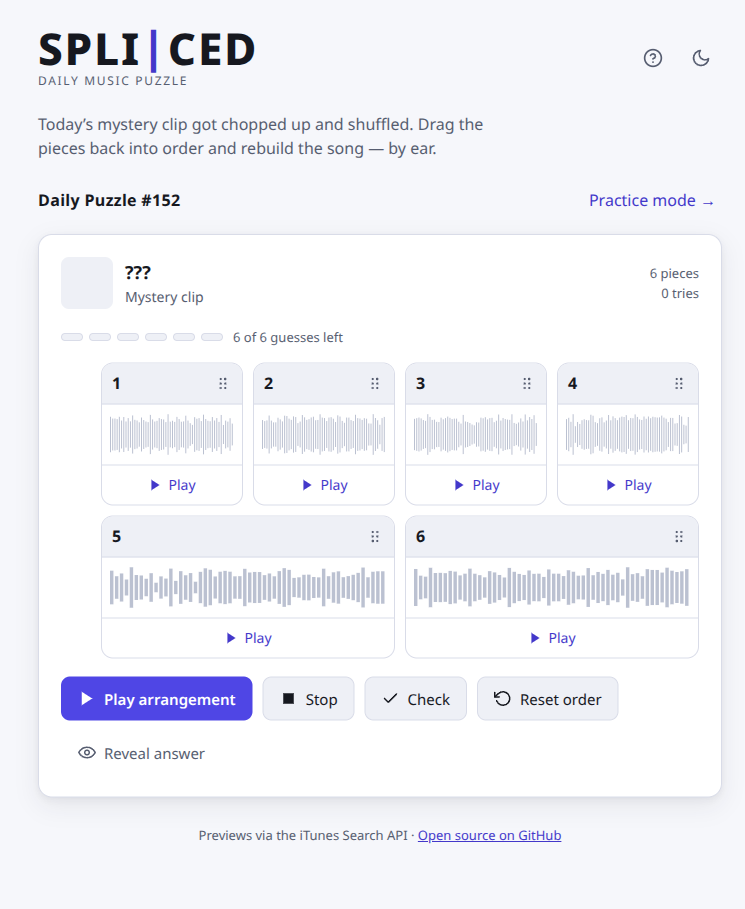
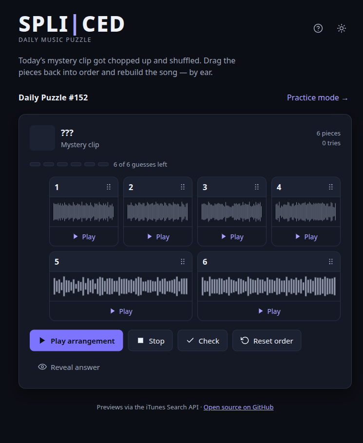

# Spliced

A **daily music puzzle**. Each day a short, _mystery_ song clip gets chopped
into equal pieces and shuffled — listen to the pieces, drag them back into the
right order, and rebuild the song **by ear**. You get a limited number of
guesses (Wordle-style); solve it and the answer is revealed.

Everyone gets the **same puzzle and the same scramble each day** (it flips at
UTC midnight), so results are shareable.

<p align="center">
  <a href="https://github.com/kamoras/spliced/actions/workflows/ci.yml">
    
  </a>
  
  = 18" src="https://img.shields.io/badge/node-%3E%3D18-339933.svg" />
</p>

<p align="center">
  
  
</p>

## How to play

1. One tile is locked in the right spot for today’s mystery clip.
2. **Drag** the six movable tiles to reorder them — or focus a tile’s handle and
   use the **arrow keys**.
3. Press **Play** to hear the starting order or your latest submitted guess in
   full. Individual tiles cannot be auditioned.
4. Press **Submit guess** to lock in the current order, hear it played back, and
   add a color-coded history row showing which positions were right.
5. You get **3 guesses**. Solve it before they run out to reveal the song and
   **share** your result.

A separate **Practice mode** picks a random song and builds a one-off puzzle at
Easy/Medium/Hard piece counts (this spoils the song, so it's kept apart from
the daily).

## How it works

- **`/api/daily`** deterministically picks today's song by UTC date (identical
  for everyone) and resolves a free 30-second preview from the public
  [iTunes Search API](https://performance-partners.apple.com/search-api) — no
  API key. The title stays hidden in the UI until you finish.
- The preview is decoded with the **Web Audio API** and sliced into equal
  pieces, each with its own waveform thumbnail.
- One slice is **locked in a seeded daily position** and the remaining slices
  are **shuffled with a seed derived from the puzzle number**, so the scramble and
  locked tile are identical for every player.

Three tiny serverless functions live in [`api/`](./api): `daily` (today's
mystery song), `search` (Practice search proxy), and `audio` (re-serves an
Apple preview with permissive CORS so `decodeAudioData` can read it — locked to
Apple's media hosts so it can't be used as an open proxy). The same handlers are
mounted as Vite dev middleware (see [`vite.config.js`](./vite.config.js)), so
`npm run dev` gives full functionality without `vercel dev`.

## Develop

```bash
npm install
npm run dev        # http://localhost:5173
```

Other scripts:

```bash
npm run lint       # ESLint (incl. jsx-a11y accessibility rules)
npm test           # Vitest unit tests
npm run build      # production build → dist/
npm run format     # Prettier
```

## Deploy (Vercel)

This is a zero-config Vercel project:

- Framework preset **Vite** (auto-detected) → builds to `dist/`.
- The `api/` directory is deployed automatically as serverless functions.

Import the repo in Vercel and deploy — no environment variables required. Vercel
also gives you a **preview deployment for every pull request** and **production
deploys from `main`** automatically.

## Accessibility

Spliced targets **WCAG 2.1 AA**:

- Full keyboard play, including reordering pieces via the keyboard (dnd-kit
  keyboard sensor) with screen-reader announcements.
- Tile correctness is shown with an **icon and a word**, never color alone.
- Visible focus styles, semantic landmarks, labelled controls, and an
  `aria-live` region for guess feedback.
- Light and dark themes with AA contrast, and `prefers-reduced-motion` support.

Accessibility is checked in review with [axe](https://github.com/dequelabs/axe-core)
and the `eslint-plugin-jsx-a11y` lint rules.

## Contributing

Issues and PRs are welcome — see [CONTRIBUTING.md](./CONTRIBUTING.md). The daily
song rotation lives in [`api/_songs.js`](./api/_songs.js); you can also open a
**Song suggestion** issue. Dependencies are kept current by Dependabot, with
patch/minor/security updates merged automatically once CI passes.

## License

[MIT](./LICENSE) © 2026 Ryan Mack. Previews are provided by the iTunes Search
API and are intended for preview/discovery use; keep clips warm-up-sized.
