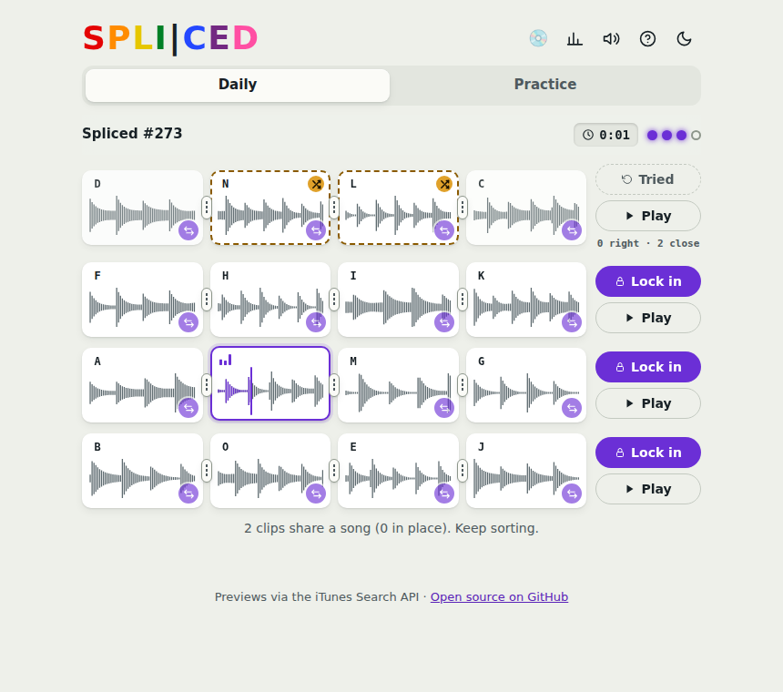
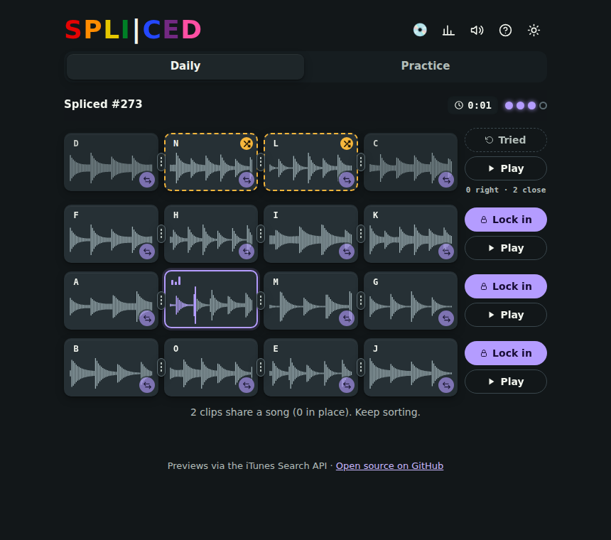

# Spliced

A **daily music puzzle** played on an 80s analog mixing console. Each day, three
mystery songs are cut into clips and shuffled across the desk. Every channel
belongs to one song, and its masking-tape label shows the year it came out.
Listen, swap, and splice each song back onto its channel before the PEAK lamps
all light up. Name each song for a bonus 🎵, then send your run to a friend to
race your ghost.

Everyone gets the **same puzzle and the byte-identical audio each day** (it
flips at UTC midnight), so times and scores are shareable.

<p align="center">
  <a href="https://github.com/kamoras/spliced/actions/workflows/ci.yml">
    
  </a>
  
  = 20.19" src="https://img.shields.io/badge/node-%3E%3D20.19-339933.svg" />
</p>

<p align="center">
  
  
</p>

## How to play

1. **Tap a clip to hear it.** That also _cues_ it — every other clip then shows
   a ⇄ button: tap one to swap the two clips. (Or press-and-drag one clip onto
   another; every move is a swap.) Tap two year tapes to swap whole channels.
2. **Listen for the seams.** Clips were cut back-to-back, so true neighbours
   flow seamlessly. Turn the knob between two clips to hear just their join, or
   press **PLAY** to hear a whole channel. Replays are always free.
3. **LOCK** a channel to check it against that channel's song: ✓ right song,
   right slot; ⤨ right song, wrong slot; blank — another song. A wrong lock-in
   lights one of **4 PEAK lamps** (and adds the genre to that channel's tape as
   a consolation clue); re-checking an arrangement you already tried is free.
   Lock a whole song on the wrong year and it costs a mistake, but slides home.
4. A correct channel **opens**: the clips splice together, the title is
   written onto the tape, and the song plays in full. Pick its title from four
   same-genre, same-era choices to **name that tune** (🎵 bonus, no penalty).
5. Finish to get your score: mistakes first, then time, songs named, and
   **takes vs par** (every clip, join and channel order you hear for the first
   time, plus each LOCK; knowing the music means fewer takes), and a
   Wordle-style share grid. The share link carries a spoiler-free **ghost** of
   your run that friends race live (ranked by win, mistakes, takes, then time).

Your progress survives a refresh, a stats sheet tracks streaks and a
mistakes histogram, and every song you uncover lands in your **Record crate**.
**Practice** serves fresh mixes from past dailies (so it never spoils an
upcoming day) at Easy (3×3), Classic (3×4, the daily size), or Hard (4×4).

The console comes in **Studio Day** and **Studio Night** finishes, with
synthesized switch clicks, knob detents, a channel-open chime, and needle VU
meters that follow the music. The nameplate logo celebrates inclusive
observances (Black History Month, Women's History Month, AANHPI Heritage Month,
Pride, Juneteenth, Disability Pride Month, Hispanic Heritage Month,
Native American Heritage Month) by the player's local date — see
[`src/theme/observances.ts`](./src/theme/observances.ts); preview any with
`?theme=<id>`.

## How it works

- **Pinned catalog.** [`api/_catalog.json`](./api/_catalog.json) is a catalog of
  ~1,460 songs (≈ a year of daily puzzles) generated by
  [`scripts/build-catalog.ts`](./scripts/build-catalog.ts): cross-era curated
  classics first, then filled from the iTunes top-songs charts across many
  genres, each resolved to a free 30-second preview and tagged with its
  original release year and a friendly genre
  ([`scripts/catalog-meta.ts`](./scripts/catalog-meta.ts); run
  `npm run enrich:catalog` to refresh just that). Rebuilding reshuffles every
  daily, so `npm run build:catalog -- --force` is required. Pinning the previews means
  every player hears the **byte-identical audio** — no per-request resolution,
  no regional drift. No API key required.
- **Deterministic selection.** [`/api/daily`](./api/daily.ts) picks the day's
  three songs by UTC date via a **per-epoch shuffle** of the whole catalog: each
  full pass is a fresh deterministic shuffle, so no song repeats within an epoch
  and groupings stay varied. The puzzle number also seeds the clip slicing and
  the board scramble, so everyone gets the same board. The day's songs are laid
  out oldest-first as a timeline, one per channel.
- **Beat-aligned slicing.** Each preview is decoded with the Web Audio API and
  cut into **contiguous, back-to-back clips** from a seeded start point, so the
  correct order reconstructs a continuous passage. Songs are cut **on the
  beat**: [`scripts/beats.ts`](./scripts/beats.ts) analyses every preview at
  build time (spectral-flux onsets, harmonic-weighted tempo, beat phase;
  `npm run beats:catalog`, needs ffmpeg) and stores its tempo in the catalog,
  so each clip is a whole number of beats and any join keeps the groove. A
  wrong order is given away by melody, harmony and lyrics, not by a rhythmic
  glitch. Songs whose tempo analysis isn't confident fall back to fixed-length
  cuts, and every clip gets a 3ms edge fade so no cut can click. Turn a seam knob to
  audition any join directly. Sound effects are synthesized on the fly (no audio assets).
- **Pure game engine.** All rules live in
  [`src/game/engine.ts`](./src/game/engine.ts) as pure state transitions
  (swap, lock in, reveal, name, ghost encode/decode), so they're unit-tested
  and the whole game state can be persisted and restored.
- **Ghost race without a backend.** A finished run is encoded into a ~60-char
  URL-safe code (marks, timings, mistakes, takes — never clip or song
  identities) that rides in the share link.
- **Honest reveal.** Titles stay hidden in the UI until you finish (they're
  discoverable in the network tab — the same trade-off Heardle-style games make).

Three small serverless functions live in [`api/`](./api): `daily` (serves the
day's puzzle and its seeded name-that-tune choices from the pinned catalog),
`practice` (random songs from past dailies), and `audio` (re-serves an Apple preview with permissive CORS so `decodeAudioData`
can read it, locked to Apple media hosts so it can't be an open proxy). The same
handlers are mounted as Vite dev middleware (see
[`vite.config.ts`](./vite.config.ts)), so `npm run dev` gives full functionality
without `vercel dev`.

The codebase is **TypeScript** throughout (app, serverless functions, and
build scripts), type-checked in CI with `npm run typecheck`.

## Develop

```bash
npm install
npm run dev          # http://localhost:5173
```

Other scripts:

```bash
npm run typecheck    # TypeScript (tsc --noEmit)
npm run lint         # ESLint (incl. jsx-a11y accessibility rules)
npm test             # Vitest unit tests
npm run build        # type-check + production build -> dist/
npm run format       # Prettier
npm run build:catalog  # regenerate api/_catalog.json from iTunes (charts + curated)
```

The catalog is committed/pinned. Re-run `npm run build:catalog` to refresh it
(e.g. to add songs or replace rotated previews) and commit the result.

## Deploy (Vercel)

This is a zero-config Vercel project:

- Framework preset **Vite** (auto-detected) -> builds to `dist/`.
- The `api/` directory is deployed automatically as serverless functions.

Import the repo in Vercel and deploy. No environment variables are required.
Vercel also gives you a **preview deployment for every pull request** and
**production deploys from `main`** automatically.

## Accessibility

Spliced targets **WCAG 2.1 AA**:

- Full keyboard play: every clip, ⇄ swap target, seam knob, and row control is
  a labelled button (Enter plays/cues a clip, Esc cancels a cue).
- Clip status is shown with an **icon and border style** (solid vs dashed),
  never color alone, plus a spoken label and a text row summary; each clip
  keeps a letter so it's distinguishable without relying on hue.
- Visible focus styles, semantic landmarks, labelled controls, and an
  `aria-live` region for feedback.
- Light and dark themes with AA contrast, and `prefers-reduced-motion` support
  (shake, confetti, and splice animations stand down).

Accessibility is checked in review with [axe](https://github.com/dequelabs/axe-core)
and the `eslint-plugin-jsx-a11y` lint rules.

## Contributing

Issues and PRs are welcome - see [CONTRIBUTING.md](./CONTRIBUTING.md). The
curated classics that seed the catalog live in
[`api/_songs.ts`](./api/_songs.ts); regenerate the daily catalog with
`npm run build:catalog`. You can also open a **Song suggestion** issue.
Dependencies are kept current by Dependabot, with patch/minor/security updates
merged automatically once CI passes.

## License

[MIT](./LICENSE) © 2026 Ryan Mack. Previews are provided by the iTunes Search
API and are intended for preview/discovery use; keep clips warm-up-sized.
